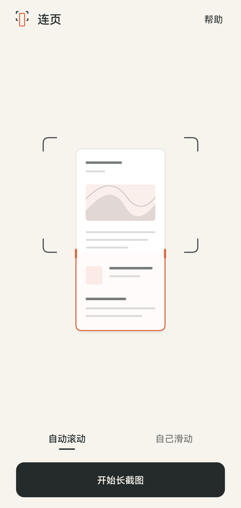
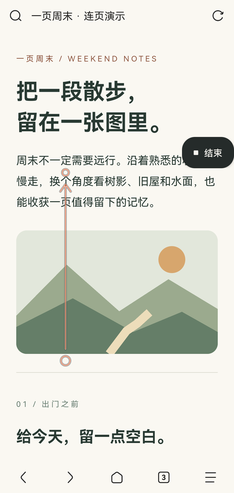
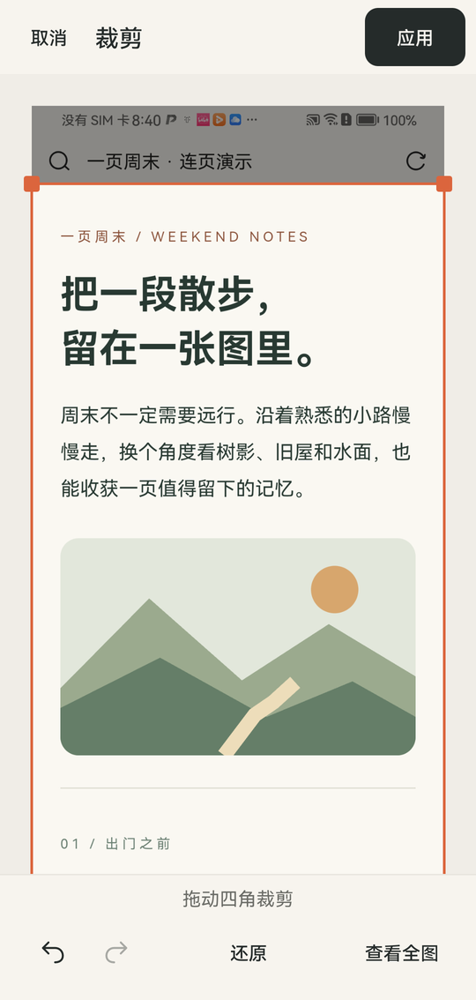
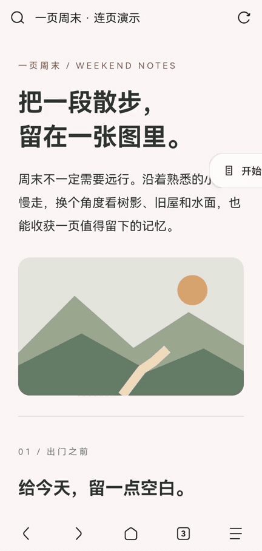

# 连页 · Lianye

[](LICENSE)
[](app/build.gradle.kts)
[](app/src/main/AndroidManifest.xml)

**连接每一屏，留下一张长图。**

连页是一款 Android 开源长截图工具。支持自动滚动和自己滑动，图片在本机拼接；完成后可以检查、裁剪、保存或分享。无需账号，应用没有网络权限、广告或追踪。

**[下载 Android 版](https://github.com/gxwane/lianye/releases/latest) · [产品介绍与视频演示](https://gxwane.github.io/lianye/) · [更新记录](CHANGELOG.md)**

<p lang="en">Lianye is a free, open-source Android scrolling screenshot app. Capture with automatic or manual scrolling, then review, crop, save, or share. Images are processed on your device. No accounts, network permission, ads, or tracking. Android 10+.</p>

从[正式发布页](https://github.com/gxwane/lianye/releases/latest)下载 `Lianye-v版本号.apk` 安装，版本内容见[更新记录](CHANGELOG.md)。Android 10 及以上可用。当前包名为 `org.lianye`，可与旧测试版分别安装。

F-Droid 用户可从[项目仓库页面](https://gxwane.github.io/lianye/)获取订阅地址。这是项目自行维护的分发仓库。

## 看看连页

<p align="center">
  <a href="docs/assets/showcase/home.png"></a>
  <a href="docs/assets/showcase/capture.png"></a>
  <a href="docs/assets/showcase/crop.png"></a>
</p>

<p align="center">选择方式，开始截图 · 向上滑，松手稍停 · 检查裁剪，保存分享</p>

### 一次完整操作

<p></p>

[播放视频](https://gxwane.github.io/lianye/#demo) · [下载 MP4](https://gxwane.github.io/lianye/assets/showcase/demo.mp4) · [查看实际成图](docs/assets/showcase/result.png)

素材来自正式版 **v0.1.0**，华为 STK-AL00 / Android 10；文章为原创演示内容。动图使用手动模式，省略等待和部分重复滑动，并加速播放；实际速度和兼容性取决于设备与页面。更多信息见[素材说明](docs/assets/showcase/README.md)。

## 使用

1. 首页直接选择 **自动滚动** 或 **自己滑动**，点击 **开始长截图**，按系统提示授权。
2. 打开目标页面，点悬浮球上的 **开始截图**。自动模式会滚动页面；手动模式按屏幕指引向上滑，松手稍停。截够后点 **结束**。
3. 在结果页检查、缩放或裁剪图片；裁剪支持撤销与重做。
4. 点击 **保存** 写入系统相册，或点击 **分享** 将图片交给所选应用。导出中显示进度，完成后显示结果。

准备好后，**去截图** 返回桌面，随后打开目标应用。截图过程中悬浮控件只保留 **结束**，滑动指引持续显示，不进入输出图片。帮助内容随当前模式变化，保留常见厂商的权限设置路径。

未保存的当前草稿会保留，包括编辑历史和查看位置。开始新截图前可以先保存、放弃或返回。已经保存的截图不再占据首页的「继续编辑」入口；再次进入应用可直接开始新截图，后续编辑交给相册或用户选择的编辑工具。异常中断时，保留已经提交的有效内容。

动态视频、重复排版、固定控件或禁止截屏的页面可能影响截图结果，请在导出前检查。

## 导出与隐私

- 默认导出 **PNG**。裁剪后的高度超过 **30,000px** 时，默认按精确像素行分图，也可选择整张长图；这是固定高度分段，不是按内容留白分页。
- 保存目标为系统相册的 `Pictures/Lianye`。多图全部写入后发布；失败时撤回本次创建的图片。
- 分享使用应用私有缓存和 FileProvider 临时读取授权，**不会自动写入相册**。多图分享包含所有图片 URI，并按内容顺序排列。
- 分享文件为接收应用保留；下次分享时清理超过 24 小时的旧缓存。系统也可能清理缓存目录。
- 应用未声明网络权限，未引入广告或追踪功能。图片处理在本机完成；用户主动分享后，接收应用按照其自身行为处理图片。
- 无障碍服务用于自动模式的屏幕捕获和滚动，不读取控件树文本或记录按键。手动模式只使用本次屏幕捕获和普通悬浮窗，无需无障碍服务。

自动模式在 Android 10 使用屏幕捕获前台服务；Android 11 及以上使用 `AccessibilityService.takeScreenshot()`。手动模式在 Android 10 及以上使用 MediaProjection，授权失效后重新授权。手动悬浮球需要「显示在其他应用上层」权限，自动悬浮球使用无障碍悬浮窗。

## 系统设置帮助

部分系统会限制从应用商店之外安装的应用。如果无障碍开关无法开启，在 **帮助与设置** 中打开应用信息，查找「允许受限制的设置」，验证后返回无障碍设置。入口名称可能随厂商和系统版本变化，应用不会在状态未知时宣称限制已解除。

帮助中的 **关于 → 查看更新** 会用浏览器打开[项目发布页](https://github.com/gxwane/lianye/releases)；应用不在后台联网检查、下载或强制更新。升级版本需要递增 `versionCode` 并保持包名和签名一致。

## 实现

Kotlin 2.1、Jetpack Compose、Material 3、AndroidX 和协程；依赖及版本以 [版本目录](gradle/libs.versions.toml) 为准。AppComponent 使用手写依赖容器。

捕获引擎匹配相邻画面的重叠区域，将新增条带落盘为瓦片。草稿以检查点持久化；预览按视口加载瓦片，缓存预算为 32MiB；导出逐行读取、裁剪并压缩成 PNG，不创建整张超长 Bitmap。性能和设备兼容性以测量为准，不承诺固定帧率、耗时或总内存峰值。

- [架构说明](docs/ARCHITECTURE.md)
- [品牌与产品原则](docs/BRAND_AND_STRATEGY.md)
- [当前进展与验收](docs/ROADMAP.md)
- [设计母稿与规范](design/README.md)

## 构建与检查

需要 JDK 17、Android SDK 35。仓库自带 Gradle 8.11.1 Wrapper。

Windows PowerShell：

```powershell
.\gradlew.bat :app:testDebugUnitTest
.\gradlew.bat :app:lintDebug
.\gradlew.bat :app:verifyZeroNetworkDependencies
.\gradlew.bat :app:assembleDebug
```

macOS/Linux 使用 `./gradlew` 替代 `.\gradlew.bat`。网络依赖检查是按已配置关键字检查运行时依赖，不等同于完整安全审计。

工程名称为 `Lianye`，仓库为 [`gxwane/lianye`](https://github.com/gxwane/lianye)。正式包使用 `org.lianye`，Debug 包使用 `org.lianye.debug`。构建 Release 需要配置本地签名凭据，再运行 `:app:assembleRelease`；签名材料和密码不得提交仓库。发布安装包命名为 `Lianye-v版本号.apk`。

## 许可证

[MIT License](LICENSE)。项目参考了 [android-scroll-capture](https://github.com/garregusev/android-scroll-capture) 的手势与屏幕捕获实现思路。
