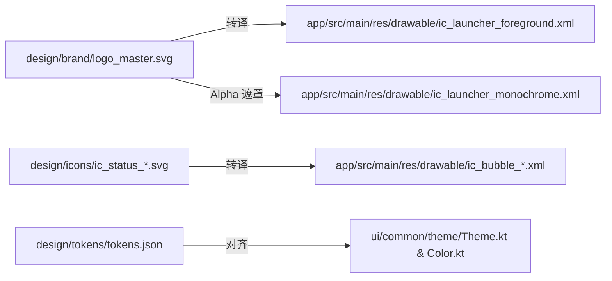

# ScrollLoom (长卷) 设计中枢规范 (Design Hub)

本项目采用 **“同仓原生设计体系 (Colocated In-Repo Design SSOT)”** 架构，将设计母稿、设计令牌、交互状态机与高保真原型在根目录 `design/` 进行统一收敛与版本控制。

---

## 一、 目录全景与职责边界

```
design/
├── README.md                  # [本文件] 设计中枢总纲、规范准则与协作流程
│
├── brand/                     # 1. 品牌与标识母稿区
│   ├── logo_master.svg        # W3C 开放矢量母稿 (108x108 画布，核心保留在 66dp 安全区)
│   ├── icon_grid_guide.svg    # Android Adaptive Icon 安全区网格与基准线
│   └── assets/                # 导出的高分辨率渲染图 (512x512 Store 图标等)
│
├── icons/                     # 2. 应用内矢量微图标源稿区 (24x24 dp，替代 Emoji)
│   ├── ic_status_idle.svg     # 悬浮胶囊待命/就绪状态
│   ├── ic_status_weaving.svg  # 编织中动态/微动效线框
│   ├── ic_status_done.svg     # 编织完成状态
│   └── ic_status_alert.svg    # 异常告警状态
│
├── tokens/                    # 3. 设计令牌 (Design Tokens) 规范区
│   ├── tokens.json            # 机器可读的全局 Token 字典 (色阶、圆角、间距网格)
│   └── DESIGN_TOKENS.md       # 色彩体系与排版阶梯说明文档 (人类与 Agent 共同对照)
│
├── specs/                     # 4. 交互规格与状态机定义区 (PRD 级文档)
│   ├── INTERACTION_STATES.md  # 完整 UI 状态流转机 (就绪/录制/双缓冲避让/异常恢复)
│   └── ACCESSIBILITY_GUIDE.md # Android 13+ 受限制设置与电池优化交互走查矩阵
│
└── mockups/                   # 5. 视觉概念与走查效果图 (供推敲斟酌)
    ├── screen_main_concept.md # 主页视觉概念与卡片排版规划
    └── store/                 # 商店 1024x500 宣传头图概念与带壳效果图
```

---

## 二、 核心隔离与安全准则

1. **Gradle 构建绝对隔离**：
   * 本目录位于 Android 工程根目录，独立于 `:app` 模块之外；
   * Gradle 构建系统的 `sourceSets` 完全不包含此目录，**绝不向最终 APK 打包任何未转译的设计原稿**；
   * 严禁在本目录引入任何外部网络下载脚本，杜绝触发 `verifyZeroNetworkDependencies` 构建守卫。

2. **Git 仓库轻量化准则**：
   * 母稿坚决使用 W3C 开放纯文本 **SVG 格式**，支持代码级 Git Diff 与审查；
   * 严禁将重型专有工程（`.fig`, `.sketch`, `.psd`, `.ai`）或超大未压缩视频直接提交入主仓；
   * 过程探索与草稿保留在外部或云端，主仓只沉淀定稿母稿。

---

## 三、 设计到代码转换流 (Design-to-Code Pipeline)


