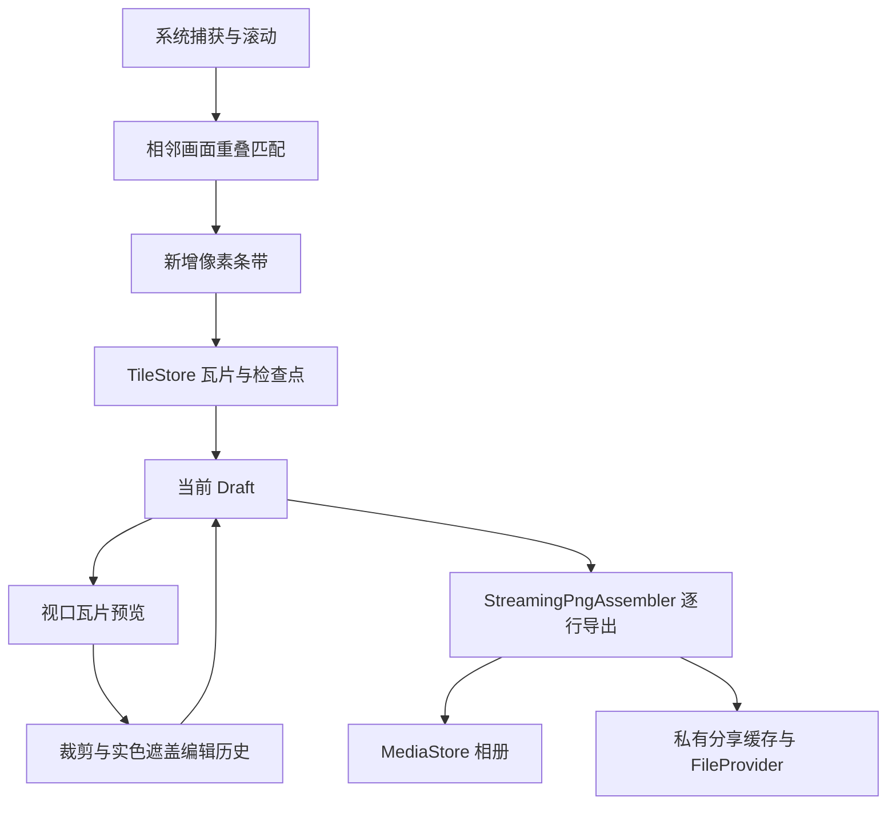

# 连页：实现架构

## 平台与依赖

`minSdk 29`、`compileSdk/targetSdk 35`。Kotlin 2.1、JVM 17、AGP 8.8、Gradle Wrapper 8.11.1；Compose、Material 3、AndroidX 与协程版本由 `gradle/libs.versions.toml` 管理。AppComponent 使用手写依赖容器。

Android 10 使用 MediaProjection 捕获与前台服务，授权失效后需重新获取。Android 11+ 使用 AccessibilityService.takeScreenshot。两条路径共用捕获接口和拼接引擎；无障碍服务负责手势及 TYPE_ACCESSIBILITY_OVERLAY 控件。

Manifest 不声明网络权限。构建守卫检查运行时依赖是否匹配已配置网络或追踪库关键字；它不是完整安全审计。截图像素可能包含隐私，用户主动分享会将导出图片交给接收应用。

## 任务与数据流

LianyeRepository 分别维护截图任务、服务连接、捕获授权、悬浮窗可见性和当前草稿。引擎报告帧数、累计高度、视口高度及完成原因；界面由实际高度计算约截取屏数，不使用帧数代替屏数。任务区分用户结束、触底与各类中断；异常保留已提交内容。

OverlapMatcher 采用亮度特征、重叠搜索和匹配结果处理相邻画面。TemporalVarianceMask 与受控手势辅助处理固定画面和滚动稳定性。动态内容、重复排版和系统捕获限制仍需实机检查，不保证所有页面匹配成功。

## 当前草稿与恢复

Draft 保存瓦片索引、编辑历史及当前历史索引、修订版本、已保存版本、查看偏移和缩放、完成原因。裁剪和遮盖使用原始图像像素坐标；撤销重做改变编辑快照，原始瓦片不被编辑覆盖。

DraftStore 位于应用私有 `filesDir/drafts/current`。瓦片先写入临时文件，再提交；草稿元数据包含校验信息，并使用备份和替换流程。恢复检查已提交元数据及瓦片，不把尚未提交的缓冲数据视为完整截图。磁盘不足或写入失败时保留可恢复内容并向界面报告。

应用只保留一个当前草稿。离开前台和系统分享不清空草稿；开始新截图前处理未保存结果，完成或放弃时清理内部文件。ExportCoordinator 在应用作用域中协调导出，避免界面重建重复启动任务。

## 预览与导出

PreviewTileCache 按可见范围和缩放比例解码瓦片，使用 32MiB 缓存预算。这是预览缓存限制，不是应用总内存峰值承诺。视口变换、选择范围和导出均使用相同的原始像素坐标。

StreamingPngAssembler 逐行读取 ARGB 瓦片，应用裁剪，将遮盖区域替换为不透明黑色，再编码为 RGBA PNG。不会生成整张超长 Bitmap。分图按精确行边界切分，允许边界位于瓦片内部，每段最高 30,000px；整图模式使用完整裁剪高度。不做空白内容分析。

保存通过 MediaStore 的 pending 状态创建图片，全部部分写完后发布；异常回滚本次创建的记录。保存状态针对草稿修订版本，后续编辑需要再次保存。

分享导出到私有 `cacheDir/share`，FileProvider 暴露临时读取 URI。单张使用 ACTION_SEND，多张使用 ACTION_SEND_MULTIPLE；EXTRA_STREAM 和 ClipData 包含全部图片。下次分享时清理超过 24 小时的旧文件，不依赖定时器，也不在分享取消时立即删图。

## 验证边界

JVM 测试覆盖状态、草稿校验与恢复、像素编辑、跨瓦片分段和导出事务等纯逻辑。系统授权、截图能力、目标应用滚动、悬浮窗避让、接收应用和性能必须实机验证。耗时、固定帧率、总内存上限和设备兼容性不由结构或单元测试直接保证。
